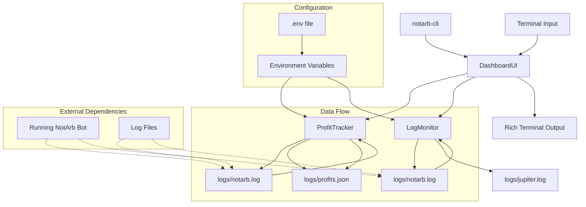
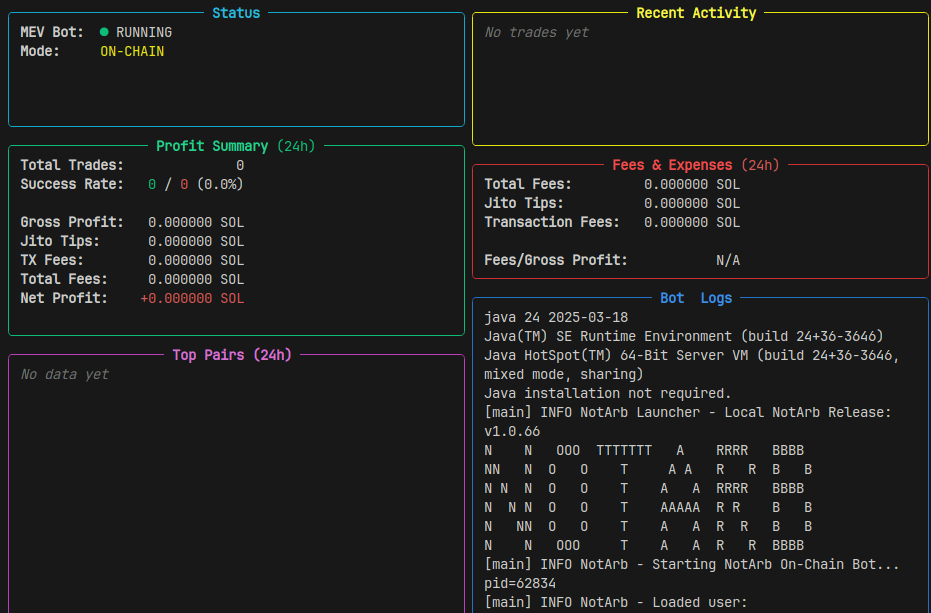

# NotArb CLI Monitor

[](https://pypi.org/project/notarb-cli/)
[](https://opensource.org/licenses/MIT)
[](https://www.python.org/downloads/)

A terminal-based monitoring dashboard for NotArb MEV bots. Displays real-time profit tracking, fees analysis, and log monitoring.

## Technology Stack

This CLI is built with modern Python technologies:

- **Python 3.8+** - Core language with type hints and modern features
- **Rich** - Beautiful terminal UI with colors, tables, and interactive elements
- **Psutil** - Cross-platform system and process monitoring
- **Python-dotenv** - Environment variable management from .env files
- **Setuptools** - Modern Python packaging with pyproject.toml

### Key Features

- **Real-time log monitoring** using `tail` command and file watching
- **Rich terminal interface** with keyboard navigation and live updates
- **Thread-safe profit tracking** with file locking for multi-process safety
- **Environment-based configuration** for flexible deployment
- **Cross-platform compatibility** (Linux, macOS, Windows)

## Architecture



### Components

- **DashboardUI**: Main interface handling user input and display rendering
- **ProfitTracker**: Parses log files for profit data, calculates fees and statistics
- **LogMonitor**: Tails and formats log files for real-time display
- **Environment**: Loads configuration from .env files

### Data Flow

1. CLI loads environment variables from .env
2. LogMonitor tails log files in real-time
3. ProfitTracker parses profit entries and updates statistics
4. DashboardUI renders all data in interactive terminal interface



## Features

- Real-time profit/loss tracking with detailed statistics
- Fee breakdown analysis (Jito tips, transaction fees)
- Live log monitoring (bot and Jupiter server logs)
- Interactive terminal dashboard with keyboard navigation
- Process monitoring and system status

## Requirements

- Python 3.8 or higher
- Running NotArb bot with log files in `logs/` directory
- `logs/notarb.log` and `logs/jupiter.log` files present

## Installation

The CLI can be installed globally or in a virtual environment. It needs to be run from your bot's directory containing the `logs/` folder.

### Option 1: Global installation (recommended for single bot monitoring)

```bash
# Clone or download the notarb-cli package
cd notarb-cli

# Install dependencies and package globally
pip install rich psutil python-dotenv
pip install -e .
```

### Option 2: Using conda environment (on Arch Linux)

```bash
# Create and activate conda environment
conda create -n notarb-cli python=3.10
conda activate notarb-cli

# Install dependencies and package
conda install rich psutil python-dotenv
pip install -e .
```

### Option 3: Per-project installation

If you prefer to keep the CLI isolated per bot:

```bash
# In your bot directory
cd your-bot-directory

# Clone CLI as subdirectory (or install via pip)
git clone https://github.com/yourusername/notarb-cli.git cli
cd cli
pip install -e .
```

**Important**: After installation, run `notarb-cli` from your bot's root directory (where `logs/` folder is located).

## Usage

1. Ensure your NotArb bot is running and generating logs in the `logs/` directory
2. Run the CLI monitor:
   ```bash
   notarb-cli
   ```
3. Use keyboard shortcuts to navigate:
   - `L` - View logs
   - `P` - Profit report
   - `F` - Fees report
   - `B` - Toggle bot (if applicable)
   - `Q` - Quit

## Configuration

### Environment Variables

The CLI uses environment variables for configuration. Copy `examples/.env` to your project root as `.env` and modify the values:

```bash
cp examples/.env .env
```

Edit `.env` to set your RPC URL and other variables:
```
DEFAULT_RPC_URL=https://your-rpc-endpoint.com
```

The CLI automatically loads `.env` files using python-dotenv.

### Directory Structure

The CLI expects the following directory structure:
```
your-bot-directory/
├── .env                    # Environment variables
├── logs/
│   ├── notarb.log      # Bot log file
│   ├── jupiter.log     # Jupiter server log file
│   └── profits.json    # Profit tracking data (auto-generated)
└── [run notarb-cli from here]
```

## Example Configurations

Example configuration files are provided in the `examples/` directory:
- `examples/bot-config.toml` - Sample bot configuration
- `examples/jupiter-config.toml` - Sample Jupiter server configuration
- `examples/example_config.txt` - Additional configuration examples

Copy and modify these files according to your setup.

## Log Format Requirements

The CLI parses profit information from log lines. For accurate tracking, ensure your bot logs profit information in formats like:

```
Profit: 0.001 SOL
Arbitrage executed. Net: 0.005 SOL
```

## Dependencies

- `rich` - Terminal UI library
- `psutil` - System and process monitoring
- `python-dotenv` - Environment variable loading

## License

MIT License

## Troubleshooting

### No logs displayed
- Ensure `logs/notarb.log` and `logs/jupiter.log` exist
- Check file permissions
- Verify bot is running and writing to log files

### Profit parsing not working
- Check log format matches expected patterns
- Verify profit amounts are logged as "Profit: X.XXX SOL"

### Permission errors
- Run with appropriate user permissions
- Ensure log files are readable

## Development

To contribute or modify:
```bash
# Install in development mode
pip install -e .

# Run tests (if available)
python -m pytest

# Run the CLI
notarb-cli